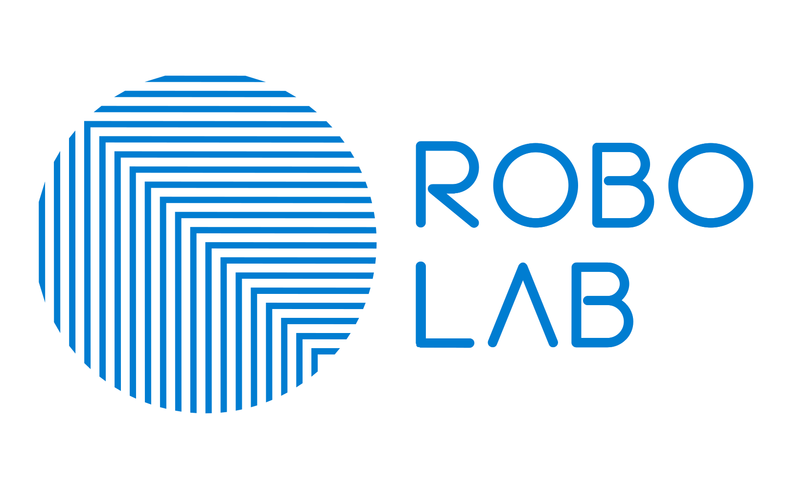

# Robo Co-op Design System

Design tokens, logo assets and a framework-free CSS layer for the four Robo Co-op brands.

Built from **Brand Guidelines UPDATE.pdf** and the master logo artwork. Every colour, type
size and rule in here traces back to that document — and where the document contradicted
itself, the deviation is recorded rather than silently resolved.

```
Robo Co-op          #000000   Support together   — Human⇄Machine Cooperative OS
├── Robo Lab        #007DD1   Work together      — Pioneering Systemic Lab
├── Co-op Lab       #FF3F33   Startup together   — Cooperative Entrepreneurship Lab
└── Robo University #6EC207   Learn together     — Explorative Digital Education
```

---

## Quick start

```bash
npm run build     # compile tokens -> CSS
npm start         # build, generate docs, serve on http://localhost:4173
```

There are **no dependencies**. Everything runs on Node's standard library, so the repo
still builds in five years without an `npm install` archaeology session.

In a page:

```html
<html data-brand="robo-lab">
  <link rel="stylesheet" href="dist/css/robo-design-system.css">
```

That single attribute switches the entire palette. Light is the default and dark follows
the operating system; add `data-theme="dark"` or `data-theme="light"` to force one.

---

## What's in here

| Path | What it is |
|---|---|
| `tokens/core.json` | Brand-agnostic foundations — type scale, space, radius, motion, elevation |
| `tokens/brands/*.json` | One file per brand: raw palette plus light and dark semantic themes |
| `src/css/` | Hand-written base layer and components. The only files you edit by hand |
| `assets/logos/<brand>/` | Normalised SVG lockups, PNG fallbacks, and `manifest.json` |
| `dist/` | Generated. Never edit — `npm run build` overwrites it |
| `docs/` | Generated documentation site. Open `docs/index.html` |
| `scripts/` | The build. Roughly 700 lines, all commented |

### Scripts

```bash
npm run assets           # re-import logo artwork from the master Illustrator exports
npm run tokens           # tokens/*.json -> dist/css/tokens.css + dist/tokens.{json,js}
npm run bundle           # concatenate tokens + base + components -> one stylesheet
npm run build            # tokens + bundle
npm run check:contrast   # WCAG 2.1 AA audit; exits non-zero on failure
npm test                 # build + audit — safe to wire into CI
npm run docs             # regenerate the documentation site
```

---

## Using tokens

Build against the **semantic** layer, not the raw palette. Semantic tokens re-theme; raw
palette values do not.

```css
.panel {
  background: var(--rds-color-surface-raised);
  color:      var(--rds-color-text);
  border:     var(--rds-border-hairline) solid var(--rds-color-border);
  border-radius: var(--rds-radius-lg);
  padding:    var(--rds-space-6);
  box-shadow: var(--rds-elevation-2);
}
```

### Fill colours and text colours are different tokens

This is the one concept worth internalising before using the system.

| Token | Use it for | Guaranteed |
|---|---|---|
| `--rds-color-primary` | Fills, large graphics, decorative shapes | Exact brand colour, never altered |
| `--rds-color-primary-strong` | Buttons and other fills that carry a label | ≥ 4.5:1 against `--rds-color-on-primary` |
| `--rds-color-primary-text` | Body text, links, icons on a surface | ≥ 4.5:1 against every surface and its tint |

Robo University's `#6EC207` is 2.1:1 against white. It is a beautiful fill and an illegible
text colour, and no amount of care at authoring time reliably prevents someone from using
it as the latter. So the build computes the safe siblings instead of trusting discipline.
The same trio exists for `accent`, `success`, `warning`, `danger` and `info`.

Two primaries needed adjustment to carry a label at AA:

- **Robo Lab** `#007DD1` → `#0079CB` on buttons, a 3% shift. Imperceptible.
- **Co-op Lab** `#FF3F33` → `#DB362C` on buttons, a 14% shift. White-on-red reads as a
  button; black-on-red reads as a warning label, so the fill moves and the text stays white.

`--rds-color-primary` still exports the untouched brand colour in both cases.

---

## Accessibility

`npm run check:contrast` measures **160 pairs** — 4 brands × 2 themes × 20 checks — and
fails the build if any required pair drops below AA. Current state: **160 pass, 0 fail**,
lowest ratio 4.55:1.

The build does not merely report problems, it corrects them. Authored token values are
treated as intent; these floors are enforced automatically and every adjustment is printed:

- body and secondary copy ≥ 4.5:1 on every surface it can land on
- input borders and focus rings ≥ 3:1 (WCAG 1.4.11) — a hairline alone is not perceivable
- interactive targets ≥ 44px (WCAG 2.5.5)
- colour is never the sole carrier of meaning (WCAG 1.4.1) — status components pair colour
  with an icon slot, a title, or a left rule

---

## Logos

Three lockups per brand — `mark`, `horizontal`, `vertical`.

**Distributable artwork** always keeps its real colours. Anything in a brand's folder is
safe to hand out:

| File | What it is |
|---|---|
| `<brand>-<lockup>.svg` | The brand-coloured lockup. For Robo Co-op this is the **Black** version |
| `…-inverse.svg` | The **White** version — **Robo Co-op only** |
| `…-boxed.svg` | Sits on its own white plate, for placing over photography |

**Only Robo Co-op has Black and White versions**, because only its mark is black and so
disappears on a dark surface. Robo Lab, Robo University and Co-op Lab are legible on both
and ship a single brand-coloured file. `manifest.json` exposes a `downloads` array per
lockup that encodes this, so consumers never hardcode the asymmetry.

### `inline/` — not for distribution

Each brand also has an `inline/` folder holding `…-current.svg`. These carry
`fill="currentColor"`, which lets them follow a CSS theme **when embedded as SVG source in a
page** — that is how the docs render the Robo Co-op mark black on light and white on dark
from one file.

**Never hand these out and never use them in an ``.** `currentColor` resolves against
the element's own context, so opened, downloaded, or referenced as an image they render
**black** regardless of theme. They live in a separate folder for exactly that reason.

```html
<span class="rds-logo rds-logo--md">
  
</span>
```

### Clear space and minimum size

**Clear space is 0.5X** on all four sides, where X is the height of the mark. No type, rule
or image may enter it. `.rds-logo` applies this as padding derived from the logo's own size,
so it holds at every scale rather than being a number someone has to remember.

**Minimum size is 90px wide on screen and 25mm wide in print.** Note this is a *width* rule
on the full horizontal lockup, not a height rule on the mark. `.rds-logo--horizontal` sets
`min-width: 90px`, and `25mm` inside `@media print`, so the floor is structural: shrink the
container and the logo stops rather than dropping below spec.

## Typography

Roboto for Latin, Noto Sans JP for Japanese, across eight named styles.

| Style | Print | Screen | Weight | Token |
|---|---|---|---|---|
| Title | 60 pt | 80 px | Light | `--rds-text-title` |
| Heading | 32 pt | 43 px | Bold | `--rds-text-heading` |
| Subtitle | 24 pt | 32 px | Regular | `--rds-text-subtitle` |
| Section Header | 16 pt | 21 px | Bold | `--rds-text-section-header` |
| Subheading | 12 pt | 16 px | Bold | `--rds-text-subheading` |
| Body | 12 pt | 16 px | Regular | `--rds-text-body` |
| Quote | 15 pt | 20 px | Regular italic | `--rds-text-quote` |
| Caption | 9 pt | 12 px | Light | `--rds-text-caption` |

Sizes are authored in **points**, because the guidelines specify print; screen values are
`pt × 96/72` rounded to the nearest pixel. Body at 12pt lands exactly on 16px and Caption at
9pt on 12px, which is why the two scales agree rather than merely coexisting.

Each role carries its weight, so `--rds-text-heading-weight` travels with
`--rds-text-heading` and no call site has to re-decide it. Matching classes exist:
`.rds-title`, `.rds-heading`, `.rds-subtitle`, `.rds-section-header`, `.rds-subheading`,
`.rds-quote`, `.rds-caption`. `h1`–`h4` map to Heading, Subtitle, Section Header and
Subheading. The aliases `--rds-text-display`, `-h1`, `-h2`, `-h3`, `-h4` point at these
roles; they are not separate sizes.

Three supporting sizes — `body-lg` 18px, `body-sm` 14px, `caption-sm` 10px — are flagged
`"extends": true` because they are not in the guidelines. Interfaces need denser steps than
a print hierarchy provides.

### Japanese

Japanese uses **Noto Sans JP** across the same weight roles and the same size scale, so a
bilingual page keeps one vertical rhythm. Only leading changes — `--rds-leading-ja` is 1.8
against 1.6 for Latin, because Japanese sets without word spaces and with full-height
glyphs, so Latin leading reads cramped.

The switch fires on a real language declaration — `<html lang="ja">`, or `<p lang="ja">` for
a passage inside an English page. That also tells screen readers to change voice, which a
CSS class cannot do; `.rds-ja` exists only for where you cannot set the attribute. Never mix
the two faces inside one sentence.

### Loading the fonts

The stylesheet declares the faces but does not fetch them — how you load fonts is a hosting
decision. Either link the optional file:

```html
<link rel="stylesheet" href="dist/css/fonts.css">
<link rel="stylesheet" href="dist/css/robo-design-system.css">
```

…or self-host, which is preferred for production and matters for Japanese: the full Noto
Sans JP family runs to several megabytes unless subset. Skip both and the token stacks fall
back to system UI faces, so nothing breaks.

### Re-importing artwork

`npm run assets` reads from `C:/Users/aslan/Desktop/Robo/LOGO`. Source filenames are
inconsistent — `"Primary"` vs `"<name>.svg"`, `"NO BG"` vs `"No BG"` vs `"Black BG"` — and
`"Black BG"` describes the *intended backdrop*, not a black rectangle in the file. All of
that is resolved once, in the map at the top of `scripts/prepare-assets.mjs`. Point `SRC`
elsewhere if the masters move.

---

## Deviations from the source PDF

Recorded here so nobody has to rediscover them.

| Where | Guidelines say | We ship | Why |
|---|---|---|---|
| Robo University → Mint Cream | `#39411E` | **`#EFF5E3`** | The printed hex is a copy-paste of Deep Forest beside it. The actual vector swatch fill is `#EFF5E3`, which matches the pale cream shown |
| Robo Lab → Electric Cyan | label `#00C3FF`, swatch `#00C3EF` | **`#00C3FF`** | Label taken as canonical; it matches shipped Robo Lab web work |
| Robo Lab → "Deeo Navy" | — | `deep-navy` | Typo in the source |
| Robo University → "Achive Gold" | — | `achieve-gold` | Typo in the source |
| Robo University → "Mint" | `#304528` | unchanged | Named Mint but is a dark forest tone. Name kept for traceability |
| Type scale | PDF gives H1/H2/Body/Caption in px | The 8-role pt hierarchy from the Canva guidelines | The Canva version is newer and complete. The two agree where they overlap — Body 12pt = 16px, Caption 9pt = 12px |
| Type scale | 8 roles | + `body-lg`, `body-sm`, `caption-sm`, `mono` | A print hierarchy has no dense UI steps. Additions are flagged `"extends": true` and marked in the docs |
| Clear space | PDF states the rule in prose only | **0.5X** | Taken from the Canva logo-usage diagram |
| Minimum size | not specified in the PDF | **90px / 25mm width** | Taken from the Canva logo-usage diagram. A width rule on the lockup, not a height rule on the mark |

Two source files are also misnamed: `Robo Co-op Vertical text No BG copy 2.svg` is actually
the white version, and `Robo Uninersity Black.svg` is a typo that duplicates
`Robo University.svg`. Neither is used by the import map.

### Background plates in the masters

Ten of the master SVGs paint a **full-bleed black plate** using a `<rect>` with *no* `fill`
attribute — SVG defaults that to black. They are easy to miss, because searching for
`fill="#000"` finds nothing. Every `… Black BG.svg` master is one of these.

`prepare-assets.mjs` strips any full-bleed rect from every finish except `boxed`, then
`hasFullBleedRect` re-checks the output and **throws** if one survives. Shipping a logo with
a black box behind it is the kind of fault that reaches print before anyone notices, so it
fails the build rather than relying on inspection.

Robo Lab's horizontal lockup is imported from `Robo Lab Horizontal Text White BG.svg` with
its plate stripped, rather than from the `Black BG` master, which is plated.

---

## Adding a brand

1. Copy an existing file in `tokens/brands/` and edit `$meta`, `palette`, and both themes.
2. Add the logo source paths to `BRANDS` in `scripts/prepare-assets.mjs`.
3. `npm run assets && npm test && npm run docs`.

Everything else — the CSS scope, the docs page, the switcher, the audit — picks it up
automatically. There is no registry to update.

---

## Publishing to GitHub

Not yet pushed — this repository is local only. It is initialised on `main` with one
commit. The intended remote name is **`robo-coop-design-system`**, and it must be
**private**: the logo artwork and brand colours are proprietary (see [LICENSE](LICENSE)).

With the GitHub CLI (`winget install --id GitHub.cli`, then `gh auth login`):

```bash
gh repo create robo-coop-design-system --private --source=. --push
```

Or against a repo you created by hand — make it empty, with no README, `.gitignore` or
licence, since this tree already has all three:

```bash
git remote add origin https://github.com/<you>/robo-coop-design-system.git
git push -u origin main
```

## Licence

**Proprietary. All rights reserved.** See [LICENSE](LICENSE).

The logos, wordmarks and brand colours are Robo Co-op trade marks and are not open source.
This repository is private and its contents are not licensed for redistribution or for use
by third parties without written permission.
